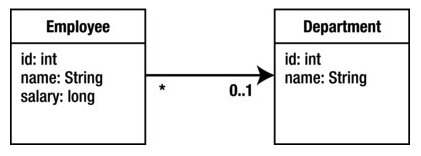

#JPA Association Mappings

###单向关联 (unidirectional) vs 双向关联 (bidirectional)

取决于业务模型中的浏览方向需求，如果没有明确需求，优先使用单向mapping。

##单值关联 (Single-Valued Associations)

目标实体的基数是1

###Many-to-One



```
@Entity
public class Employee {
    // ...
    @ManyToOne
    private Department department;
    // ...
}
```
####使用Join cloumn


```
@Entity
public class Employee {
    // ...
    @ManyToOne
    @JoinColumn(name="DEPT_ID")
    private Department department;
    // ...
}
```
Owning side - 对应的数据表有FK，relationship owner <br />
Inverse side - 对应的数据库没有FK

Mappings to columns (@JoinColumn)总是定义在owning side。如果没有定义，默认值已经owning side的属性定义。

#####mappedBy

没有mappedBy就是owning side，有mappedBy是inverse side。

Many-to-one mappings总是在owning slide一侧。

###One-to-One


```
@Entity
public class Employee {
    @Id private long id;
    private String name;
    @OneToOne
    @JoinColumn(name="PSPACE_ID")
    private ParkingSpace parkingSpace;
    // ...
}
```
####Bidirectional One-to-One


```
@Entity
public class ParkingSpace {
    @Id private long id;
    private int lot;
    private String location;
    @OneToOne(mappedBy="parkingSpace")
    private Employee employee;
    // ...
}
```
#####Bidirectional One-to-One关联的两个规则

* @JoinColumn放在数据表有FK的实体中，或者放在relationship所有者一侧。（可能是关联的另一侧）
* mappedBy应该在没有定义join column的实体中，或者在inverse side一侧。

两侧都有mappedBy是不合法的定义。<br />
两侧都没有mappedBy是不正确的，JPA Provider会当成2个单向的关联，有可能误认为两侧都有join column。

##集合关联 (Collection-Valued Associations)

###双向One-to-Many


在集合中实体所对应的表有FK，所以one-to-many关联大部分时候都是双向的，并且“one” side不是owning side。

```
@Entity
public class Employee {
    // ...
    @ManyToOne
    @JoinColumn(name="DEPT_ID")
    private Department department;
    // ...
}

@Entity
public class Department {
    @Id private long id;
    private String name;
    @OneToMany(mappedBy="department")
    private Collection<Employee> employees;
    // ...
}
```
####Bidirectional one-to-many (may-to-one)关联的两个注意点

* many-to-one side应该是owning side，需要定义join column。
* one-to-many mapping 是 inverse side，需要使用mappedBy。

###单向集合映射(Unidirectional Collection Mappings)

当实体有one-to-many关联到目标实体时，如果@OneToMany注解上没有mappedBy，就是一个单向关联。这意味着目标实体上没有many-to-one关联回源实体。


```
@Entity
public class Employee {
    @Id private long id;
    private String name;
    @ManyToMany
    @JoinTable(name="EMP_PROJ",
          joinColumns=@JoinColumn(name="EMP_ID"),
          inverseJoinColumns=@JoinColumn(name="PROJ_ID"))
    private Collection<Project> projects;
    // ...
}
```
[TODO]似乎不用join table也是可以的，加上@JoinColumn，FK会生成到Phone表中？

##Lazy Realtionships

When not specified on a single-valued relationship, the related object is guaranteed to be loaded eagerly. Collection-valued relationships default to be lazily loaded, **but because lazy loading is only a hint to the provider, they can be loaded eagerly if the provider decides to do so.**

通常，一侧是eager loading，另一侧是lazy loading。取决于实际的浏览方向需求。

##Embedded Objects

值对象，没有自己的ID。

@AttributeOverride

