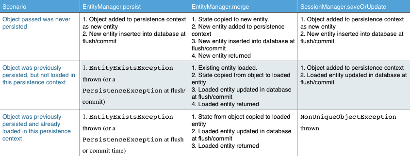

#Merge

###Session.saveOrUpdate vs  EntityManager.merge

Session.saveOrUpdate method, and its cousin Session.update, attach the passed entity to the persistence context.

EntityManager.merge method copies the state of the passed object to the persistent entity with the same identifier and then return a reference to that persistent entity. **The object passed is not attached to the persistence context.**

与EntityManager.persist不同，调用EntityManager.merge后，应当使用它返回的引用，而不是原先传递进来的引用。

使用Session.saveOrUpdate，如果persistence context中已经有相同ID的实体，会引发NonUniqueObjectException异常。



###Merge的问题

可能会破坏双向关联

###注意点

1. 只有在创建新实体的时候使用EntityManager.persist保存实体。
2. 在更新已存在实体的时候，不要调用EntityManager的方法。由JPA Provider在flush或者commit的时候自动更新到数据库。
3. 当接收应用（Persistent Context）外部对已存在的简单实体（不包含对其他实体的引用）的更新请求时，调用EntityManager.merge。不确定实体有没有persist过，也可以这样做。
4. 如果我们需要更多控制，可以先使用EntityManager.find判断实体是否已经存在于数据库中。

示例：

```
Order existingOrder = dao.findById(receivedOrder.getId());
	if(existingOrder == null) {
		dao.persist(receivedOrder);
	} else {
		existingOrder.setCustomerName(receivedOrder.getCustomerName());
		existingOrder.setDate(receivedOrder.getDate());
	}

```

实际上，如果实体使用ID作为Surrogate key，可以直接判断ID是否为空。


**参考文章** http://blog.xebia.com/2009/03/23/jpa-implementation-patterns-saving-detached-entities/