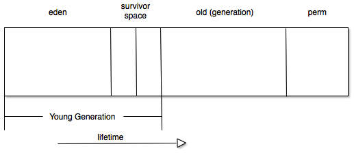
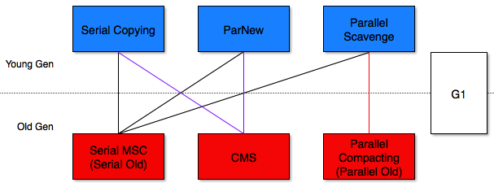

# Hotspot VM GC

## 基础知识

### 常用GC算法

#### 复制（Copying）

对象分配在From中；从GC Root开始，找到From中的存活对象，复制到To中；From和To交换。

* 不需要标记和清除，效率高
* 不会产生内存碎片
* 可使用bump-the-pointer实现快速内存分配
* 需要双倍空间

#### 标记-清除（Mark-Sweep）

标记 - 从GC Root开始扫描，对存活对象进行标记。

清除 - 扫描整个内存空间，回收未被标记的对象，使用free-list记录可用区域。

* 不需要额外空间
* 内存碎片
* 2次扫描，耗时长

#### 标记-整理（Mark-Compact）

标记 - 从GC Root开始扫描，对存活对象进行标记。

压缩 - 再次扫描，并把存活对象向一段移动。

* 没有内存碎片，可以使用bump-the-pointer
* 移动对象带来额外成本

#### Mark-Sweep-Compat

* Mark-Sweep 和 Mark-Compact的结合。
* 和Mark-Sweep一致,当进行多次GC后才Compact。
* 降低移动对象的成本。

### 分代垃圾回收

##### 三种object lifetime

* short living
* medium living
* long living

大部分对象生命周期非常短

##### 将object lifetime structure和GC架构融合在一起

* 静态 - 不同的heap区域存放不同生命周期的对象
* 动态 - 不同生命周期的对象采用不同的GC算法，提高GC效率。

#### Heap Structure

#### GC类型

* Minor GC - 年轻代
* Major GC - 老年代
* Full GC - 年轻代，老年代，永久代

#### 年轻代

* 由Eden、两块相同大小的Survivor（from/to s0/s1）构成,to总为空
* 总是优先在Eden分配对象（Thread Local Allocation Buffer）
* 保存大部分生命周期较短的对象，GC频率高，采用效率较高的复制算法

#### 老年代

* 存放新生代中经历多次GC仍然存活的对象
* 新对象也有可能直接在旧生代分配
* GC频率相对较低，标记(mark)、清理(sweep)、压缩(compaction)算法的结合和优化。

#### 对象晋升（Promotion）

存活对象在2个survivor之间不断copy, 最终会进入老年代。
复制的频率取决于：

* survivor space的大小
* Eden和from中存活对象的数量
* age threshold

### Hotspot VM GC

#### 年轻代可用GC

均使用复制算法,原理上是一致的:

1. 拷贝eden和from中的存活对象到to中
2. 部分对象由于某些原因晋升到old中
3. 清空eden、from，from和to交换身份直到下一次GC发生

触发时机：分配对象时，Eden空间不足时

##### Serial Copying

* Serial, Stop-the-world
* 对象直接分配在Old的情况
	* 对象大小超过eden space大小
	* 大对象 (PretenureSizeThreshold) 
	
* 晋升规则
	* 经历多次minor gc仍存活的对象
	* To放不下的(剩余空间不够)对象直接晋升

##### Parallel Scanvenge

* Parallel、Stop-the-world
* 并行行线程数默认值
	* CPU核数 <= 8 : =CPU核数
	* CPU核数 > 8 : =(3 + CPU核数*5)/8
	* -XX:ParallelGCThreads=n
* 根据minor GC的频率、时间等动态调整Eden/S0/S1的大小 (-XX:-UseAdaptiveSizePolicy关闭)
* 对象直接分配在Old的情况
	* 在TLAB和eden上分配失败，且对象大于eden的一半大小
	* PretenureSizeThreshold参数是无效的
* 晋升规则
	* 经历多次minor gc仍存活的对象 **和Serial Copying的区别？**
	* To放不下的(剩余空间不够)对象直接晋升

##### ParNew

* Parallel、Stop-the-world
* Serial Copying的多线程版本
* 可以搭配 CMS，不可搭配 Parallel Old

#### 老年代可用GC

##### Serial MSC

* Serial、Stop-the-world，使用Mark-Sweep-Compact算法

##### Parallel Compacting

* Parallel、Stop-the-world
* 使用Mark-Compact算法

##### Concurrent Mark-Sweep

* Parallel、Concurrent
* 使用Mark-Sweep算法
* 缩短GC暂停时间，增加了GC总时间
* 默认并发线程数 = (新生代并行GC线程数+ 3)/4，可用-XX:ParallelCMSThreads=n来指定。
* -XX:+CMSPermGenSweepingEnabled -XX:+CMSClassUnloadingEnabled
* 缺点
	* 与应用抢占CPU
	* GC总耗时长
	* 浮动垃圾(Floating Garbage)
		* Concurrent Sweep 阶段有新的垃圾产生,只能下一次GC时被收集
		* Old需要预留空间,达到一定使用比例即触发GC -XX:CMSInitiatingOccupancyFraction=n
		* Concurrent Mode Failure，退而使用Serial MSC
	* 内存碎片 - free list中没有合适内存空间来分配对象，只能触发full GC。
		* -XX:+UseCMSCompactAtFullCollection
		* -XX:CMSFullGCsBeforeCompaction=n
	* Minor GC耗时增长 - 每次Promotion都要搜索free list

	