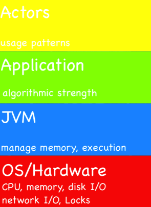

#Performance Methodology

* 理解性能需求 - 响应时间，吞吐量
* 不要对现象进行随意的猜测，而是进行测量
	* 使用系统化的方法
	* 按照合理、正确的步骤得到结论
* 测量数据不能脱离上下文，保证测量数据的正确性

###进程诊断模型 (Process Diagnostic Model)

* 用户驱动应用
* 应用驱动JVM，相对于用户的函数
* JVM驱动OS/硬件，相对于JVM的函数
* 硬件资源被消耗了，不能超出容量

####硬件资源模式

* 性能计数器显示了硬件资源如何被消耗
	* 不可分享组件的使用率
	* 展现应用程序的运行情况
* 硬件资源消耗是相对于负载的函数

#####主要消耗者 (Dominating Consumer)

* 查看CPU使用率
* 分析垃圾回收日志

可能是应用程序，可能是JVM或者System

#####测量消耗

* System - Kernel Time
* Application, JVM - User Time
* Idle - Liveliness

###Benchmarking

####建立准确的测试环境

* 定义
	* Unit of Test
	* Test Harness
* Relevant: 能够重现问题现象
	* 注意Cache的影响
* Isolated: 能够隔离其他副作用
* Measurable: provides the needed metrics
* Reliable: produces consisten results

####Setup

* 应用配置和生产环境一样
* 监控设置 OS performance counters和GC logging

####指标

#####Throughput (Bandwidth)

容易测量

#####Time (latency)

很难测试到可靠值

response time = ∑execution + ∑dead time

###如何给应用提速

####Top-Down

* 找出不满足功能需求的transaction
* 找出主要的消耗源
	* 发掘问题本质
	* System->Application->Microarchitecture

#####以CPU使用率为入口点, sys%

* network, scheduling, swapping或者其他内核活动

######network

* hardware/OS配置
* 改变application

######Scheduling

上下文切换

######Swapping

* 避免swapping
* 关掉其他应用以增加可用内存

######Kernel

* Bug
* Unusual API chooices from the JVM and/or application

######中断

######IO Wait

* 所有的IO都是必要的？
* caching, buffering
* faster disk

######Idel%

* Running low-threaded application on multicore
	* improve paralyzation of algorithms
	* throw away CPUs
* There are not enough threads ready to run
	* Locking
	* Waiting for something

#####user%

######内存

cache misses

######TLB

######Cache

#####Little’s Law

	