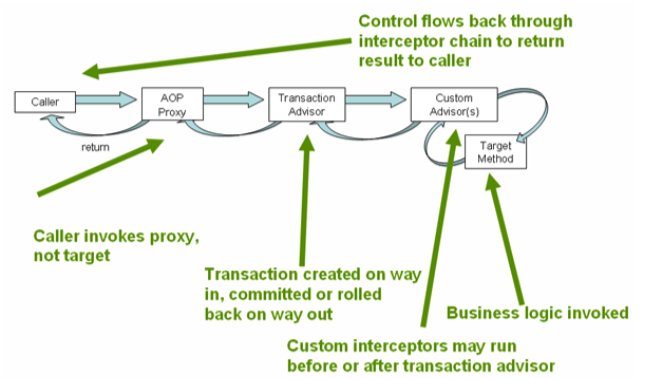

#Spring事务管理

###编程式事务管理 vs 声明式事务管理

使用编程式事务管理时，必须显示的调用begin()方法去开启事务,调用commit()或和rollback()去提交或回滚事务。适用情况：

* 客户端发起事务
* 使用本地的JTA事务
* 长时间运行的JTA事务

声明式事务管理，开发人员需要告诉容器“如何”去管理事务。

###事务属性

* Required(需要) PROPAGATION_REQUIRED

目标对象方法 需要一个事务。如果事务上下文已经存在,容器将会使用它;否则,容器将为此方法开启一个新事务。这是最常用到的事务属性。

* Mandatory(强制必须) PROPAGATION_MANDATORY

和Required属性不同,**容器并不为目标对象开启新的事务**。当使用这个事务属性时,当方法被调用时,一个事先存在的事务上下文必须存在。如果此事务上下文不存在,容器将会抛出一个 TransactionRequiredException。

* RequiresNew(需要新的) PROPAGATION_REQUIRES_NEW

需要开启一个新的事务。如果先于方法调用前一个事务已经开启了, 此事务将被暂时挂起,容器启动一个新的事务。当这个新事务随着方法调用完成终止后,老的事务将会继续。

一个事务如果需要与其外围包裹事务(surrounding transaction)相独立,不受其执行结果的影响,这个属性相当有用。

* Supports(支持) PROPAGATION_SUPPORTS

对象方法不需要一个事务上下文,但当调用到这个方法而事务上下文碰巧存在时,该方法会使用这个事务上下文。

* NotSupported(不支持) PROPAGATION_NOT_SUPPORTED

被调用的对象方法不使用事务。如果一个事务业已启动,容器会将此事务暂停直至方法调用结束。如果调用方法时没有事务存在,容器也不会为此方法开启任何事务。在方法逻辑中有排斥事务上下文的代码存在时,这个属性就非常有用了。

* Never(不用) PROPAGATION_NEVER

在调用对象方法时,不允许有事务上下文存在。要注意它和NOTSUPPORTED属性的区别。当使用NotSupported 属性时,如果方法调用之前事务存在,容器会暂停此事务以执行方法,方法在没有事务上下文的环境下执行;而使用 NEVER属性时,如果方法调用前事务存在,容器直接会抛出异常。

使用Never属性会造成一些不可预期和不希望发生的运行时异常,因此,在没有确定绝对必要时,最好不使用它。事实上,也没有太多的需求需要使用这个属性去构造事务解决方案。**当我们为此事纠结时,选择NOTSUPPORTED属性也许就够了。**

----
Spring有一个附加的属性PROPAGATION_NESTED,告知Spring进行事务嵌套,并采用Required属性。(如果要使用这个设置,底层事务服务实现必须要能支持嵌套事务。)

以上列出的事务属性能被应用于bean对象级别,通常我们会将它们应用在bean的方法级别。当事务属性被应用在 bean级别,bean中所有的方法都被赋予相同的事务属性。如果有方法特别的应用了其他事务属性,方法级别的属性会被使用。

----
**当给方法指派事务属性时,最好的做法是为类级别指派所需要的最严格的事务属性,而后在 方法的级别上按需微调。**

**事务管理应在开启事务的方法中进行。因此,开始事务的业务方法具备调用setRollbackOnly()的责任。**

**如果一个方法需要事务上下文,但不负责将此事务标记为回滚(rollback only)的状态,该方法应使用 Mandatory事务属性。**

###@Transactional

@Transactional本身定义了单个事务的范围。这个事务在persistence context的范围内。

JPA中的persistence context是EntityManager，内部实现使用了Hibernate Session（使用Hibernate作为持久化provider）。

persistence context仅仅是一个同步对象，它记录了有限集合的Java对象的状态，并且保证这些对象的变化最终持久化到数据库。

这是与单个事务非常不同的概念。**一个Entity Manager可以跨越多个事务使用**，而且的确是这样使用的。

使用Open Session In View模式时，**视图层运行的多个查询处于独立的事务中，而不是单事务的业务逻辑，但这些查询由相同的entity manager管理。**

####如何定义EntityManager和Transaction之间的关系？

```
@PersistenceContext
private EntityManager em;
```

默认为“Entity Manager per transaction”模式。这种模式下如果在@Transactional方法内部使用该Entity Manager，那么该方法将在单一事务中运行。

####@PersistenceContext如何工作？

EntityManager是一个接口，注入到spring bean中的不是entity manager本身，而是在运行时代理具体entity manager的context aware proxy（上下文感知代理）。(SharedEntityManagerInvocationHandler)

####@Transactional如何工作？

* EntityManager Proxy
* 事务的切面
* 事务管理器

#####事务的切面

事务的切面是一个“around（环绕）”切面，在注解的业务方法前后都可以被调用。实现切面的具体类是TransactionInterceptor。

事务的切面有两个主要职责：

* 在’before’时，切面提供一个调用点，来决定被调用业务方法应该在正在进行事务的范围内运行，还是开始一个新的独立事务。
* 在’after’时，切面需要确定事务被提交，回滚或者继续运行。
* 在’before’时，事务切面自身不包含任何决策逻辑，是否开始新事务的决策委派给事务管理器完成。

#####事务管理器

事务管理器需要解决下面两个问题：

* 新的Entity Manager是否应该被创建？
* 是否应该开始新的事务？

这些需要事务切面’before’逻辑被调用时决定。事务管理器的决策基于以下两点：

* 事务是否正在进行
* 事务方法的propagation属性（比如REQUIRES_NEW总要开始新事务）

如果事务管理器确定要创建新事务，那么将：

* 创建一个新的entity manager
* entity manager绑定到当前线程
* 从数据库连接池中获取连接
* 将连接绑定到当前线程

使用ThreadLocal变量将entity manager和数据库连接都绑定到当前线程。事务运行时他们存储在线程中，当它们不再被使用时，事务管理器决定是否将他们清除。程序的任何部分如果需要当前的entity manager和数据库连接都可以从线程中获取。

#####EntityManager Proxy

当业务方法调用entityManager.persist()时，这不是由entity manager直接调用的，而是业务方法调用代理，**代理从线程获取当前的entity manager。**

####完整过程

entity manager factory

事务管理器



###参考资料

http://www.importnew.com/12300.html<br />
http://www.javacodegeeks.com/2014/06/how-does-spring-transactional-really-work.html<br />
Spring Reference
