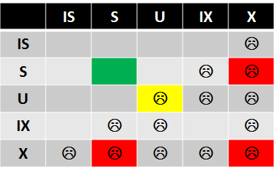

# SQL Server 锁

## What is lock?

In-memory structure (64 bytes on 32 bit OS or 128 bytes on 64 bit OS). The structure has the owner, type and resource hash that links it to the resource it protects (row, page, table, file, database, etc). 

## 重要的锁类型

### 共享锁(S) - Shared locks(S)

Reader读取一行数据的时候，SQL Server默认会请求一个共享锁。但是也有些情况，reader不请求共享锁。

### 排他锁(X) - Exclusive locks(X)

Writer在修改数据(insert/update/delete)的时候会请求排他锁，排他锁会一直持续到事务结束。

### 更新锁(U) - Update locks(U)

共享锁在数据修改请求的期间内搜索数据的时候使用。在搜索的时候，SQL Server为处理的每一行数据请求更新锁，发现满足条件的数据时，共享锁转为排他锁。

### 意向锁(IS,IU,IX等) - Intent locks(IS, IX, IU, etc)

意向锁的作用是为了在锁层次结构的较高级别上表示资源的一部分已经有锁进行保护，意向锁是一个指示器。允许在请求的锁的高级别上进行排查，可以对性能有很大的优化。

## 锁的层次结构

为了完整的保护锁定的资源，需要按顺序使用好几个锁以保证在层次结构的每个级别上资源都能得到保护。这也是意向锁的作用，意向锁可以让锁管理器知道在层次结构更低层存在某些事务正在对数据进行操作。

对象/表 IX  
|  
数据页  IX  
|  
行   X

## Lock compatibility

锁机制是资源调度的一种形式，某些资源和活动可以并行执行，而某些必须串行执行。

锁的类型决定了锁的意图以及和其他任务并发操作的意愿。

MSDN上有详细的表格说明一个锁是否可以和另一个锁同时存在，我们只需要记住下面的简单版本:

要记住以下3点：

* (S) locks are compatible with (S) and (U) locks. 共享锁和共享锁、更新锁兼容。
* (X) locks are incompatible with any other lock types. 排他锁和任何锁都不兼容。
* (U) locks are compatible with (S) but incompatible with (U). 更新锁和共享锁兼容，但和更新锁不兼容。

## 如何查看锁

todo

## 锁升级 (Lock escalation)

todo

## References

http://aboutsqlserver.com/lockingblocking/  
SQL Server 2008 内核剖析与故障排除
